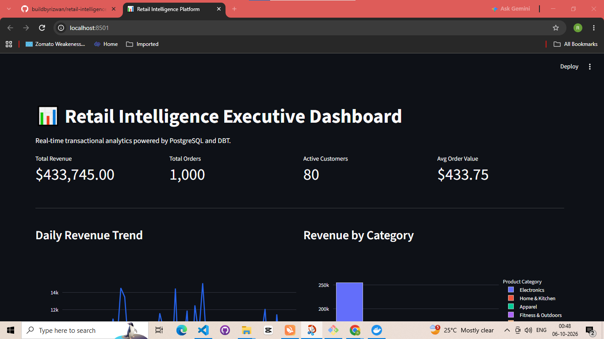
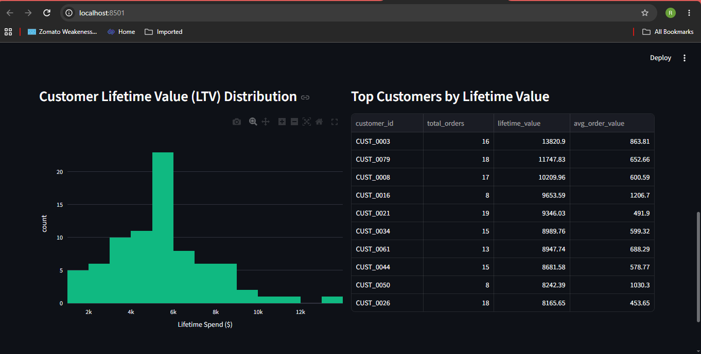
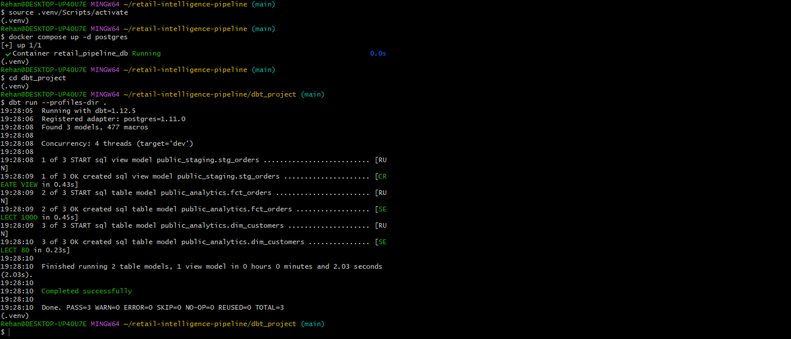

# 📊 Retail Intelligence Pipeline & Analytics Platform

An end-to-end analytics engineering platform that ingests raw transactional retail events, validates schema contracts, builds dimensional Kimball star-schema models via dbt, and serves an executive intelligence dashboard.

---

## 🏗️ Architecture
Markdown
# 📊 Retail Intelligence Pipeline & Analytics Platform

An end-to-end analytics engineering platform that ingests raw transactional retail events, validates schema contracts, builds dimensional Kimball star-schema models via dbt, and serves an executive intelligence dashboard.

---

## 🏗️ Architecture

Raw Transaction Feed (Synthetic Generator + Pydantic Validation)
│
▼
PostgreSQL Container (Raw Schema)
│
▼
dbt Transformation Engine (PostgreSQL)
├── staging.stg_orders (View)
├── analytics.fct_orders (Fact Table)
└── analytics.dim_customers (Dimension Table)
│
▼
Streamlit Executive BI Dashboard


---

## 📸 Platform & Pipeline Previews

### 1. Executive Intelligence Dashboard
Real-time KPI metrics, revenue trajectory, and category sales performance:


### 2. Customer Cohort & Lifetime Value (LTV) Analytics
Granular customer segment distribution and top high-value accounts:


### 3. Automated dbt Star Schema Transformations
Terminal output demonstrating dimensional table and view builds in PostgreSQL:


---

## ⚡ Tech Stack

* **Data Ingestion & Validation:** Python 3.11, Pydantic, Faker, SQLAlchemy
* **Data Warehouse / Storage:** PostgreSQL 16 (Dockerized)
* **Data Transformation & Modeling:** dbt (Data Build Tool)
* **Serving & BI Layer:** Streamlit, Plotly
* **Infrastructure:** Docker, Docker Compose

---

## 🚀 Quickstart Guide

### 1. Prerequisites
* Docker & Docker Compose
* Python 3.11+

### 2. Environment Setup
```bash
# Clone the repository
git clone [https://github.com/](https://github.com/)<YOUR_GITHUB_USERNAME>/retail-intelligence-pipeline.git
cd retail-intelligence-pipeline

# Create and activate virtual environment
python -m venv .venv
source .venv/Scripts/activate  # On Linux/macOS: source .venv/bin/activate

# Install dependencies
pip install -r requirements.txt

# Copy environment variables
cp .env.example .env